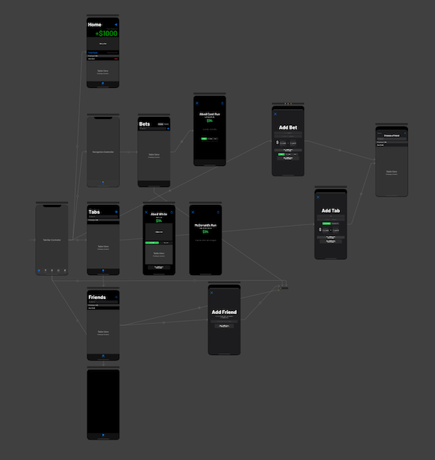

# Tabs
A simple bet and tab tracking app

# Purpose
Tabs is an app in development, owned by Araad Shams and Madhumita Mocharla. The purpose of this app is to provide a simple, easy-to-use app where people can track their bets and keep tabs on their friends.

# How It Was Built
* Xcode (for iOS App)
* Firebase (for RT Syncronization)
* Android Studio (for Android App) (planned)

# Timeline
* July 2020 - Project Started
* August 2020 - iOS App Friends, Bets, & Tabs Pages Complete
* September 2020 - Linked to Firebase Database. Security Rules being set up
* October 2020 - In Progress

# Images

